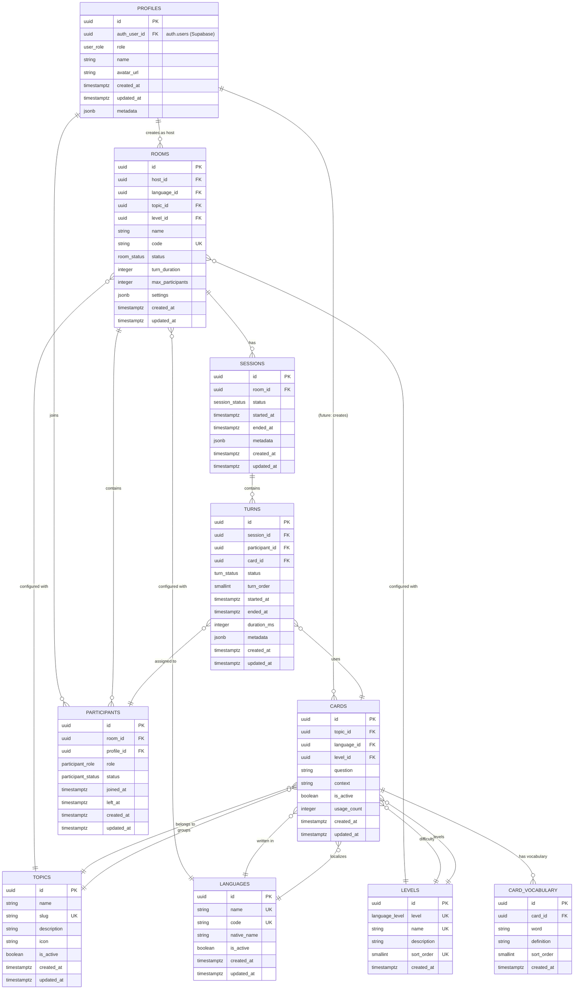

# Entity-Relationship Diagram

## Let's Talk Database Schema — MVP



---

## Compact Relationship Map

```
┌──────────┐       ┌──────────────┐       ┌──────────┐
│ PROFILES │──1:N──│ PARTICIPANTS │──N:1──│  ROOMS   │
└──────────┘       └──────────────┘       └────┬─────┘
       │                                       │
       │ 1:N                                   │ 1:N
       │                                       │
       ▼                                       ▼
  ┌──────────┐                          ┌──────────┐
  │  ROOMS   │                          │ SESSIONS │
  │ (as host)│                          └────┬─────┘
  └──────────┘                               │ 1:N
                                             │
                                             ▼
                                       ┌──────────┐
                                       │  TURNS   │
                                       └────┬─────┘
                                            │ N:1
                                            ▼
                                      ┌──────────┐
                                      │  CARDS   │
                                      └────┬─────┘
                                           │
                              ┌────────────┼────────────┐
                              │            │            │
                              ▼            ▼            ▼
                        ┌──────────┐ ┌──────────┐ ┌──────────┐
                        │  TOPICS  │ │LANGUAGES │ │  LEVELS  │
                        └──────────┘ └──────────┘ └──────────┘
                              │
                              │ 1:N
                              ▼
                        ┌──────────────────┐
                        │ CARD_VOCABULARY  │
                        └──────────────────┘
```

---

## Entity Counts (Seed Data)

| Entity | MVP Seed Count | Notes |
|---|---|---|
| Languages | 4 | English + 3 future-ready |
| Levels | 6 | A1 through C2 (CEFR) |
| Topics | 6 | All included in MVP |
| Cards | 36 | 6 topics × 6 levels |
| Vocabulary | ~100 | 2-4 words per card |